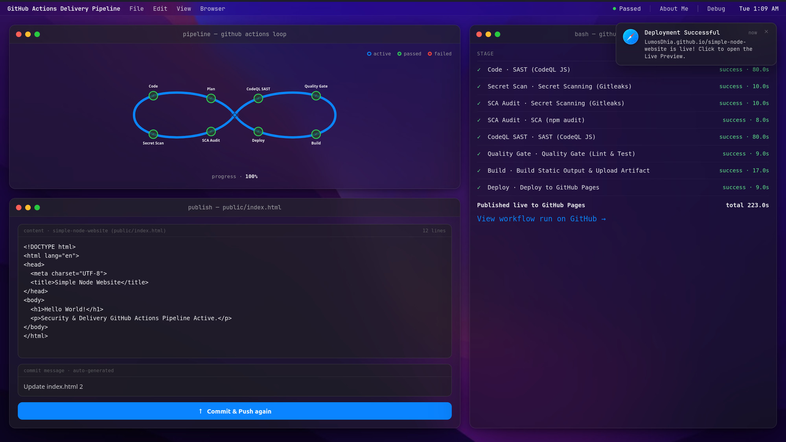

# Showcase GitHub CI/CD

## Objective

- Visualize a full CI/CD pipeline — security scans, build, and deploy — as a single animated infinity loop
- Let a visitor trigger a real commit and watch the pipeline run against it live
- Stream each stage's result (SAST, secret scanning, SCA, quality gate, build, deploy) in a terminal-style log
- Publish the pipeline's output live so visitors see a real deployed result, not a simulation

## Description

Showcase GitHub CI/CD is a React/Vite dashboard that turns a GitHub Actions delivery pipeline into an interactive "DevOps Infinity Loop": editing and committing a file kicks off a real pipeline run (CodeQL SAST, Gitleaks secret scanning, npm audit, a lint/test quality gate, build, and deploy to GitHub Pages), with each stage's status animated on the loop and streamed live in a console panel as it happens.

