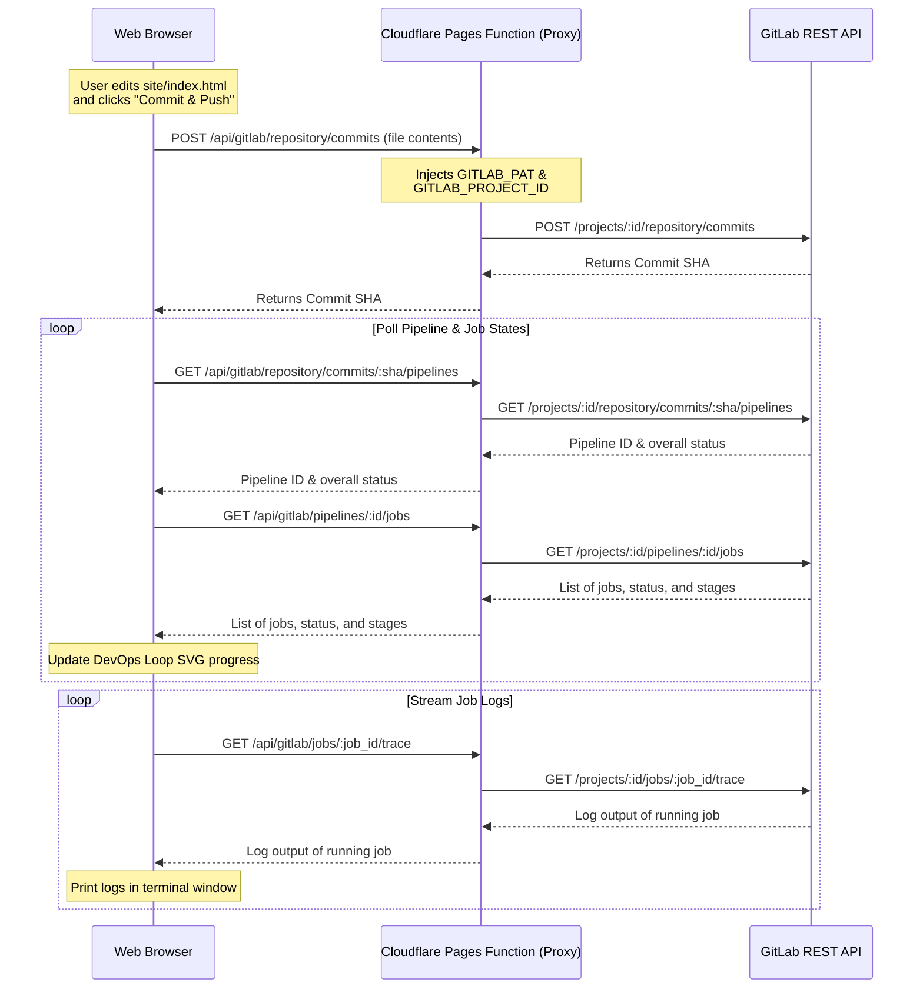

# Recreate DevOps Infinity Loop Dashboard on Cloudflare with GitLab Integration (Shared Page Visitor)

This plan details how to transform the DevOps Infinity Loop static mockup into a fully functional DevOps dashboard. Visitors to the site can commit and push changes, track pipeline status in real-time, display live job console logs, and watch the SVG DevOps loop animate dynamically.

We will use **Cloudflare Pages Functions** (serverless workers) as a secure backend proxy to inject GitLab credentials. This ensures GitLab Personal Access Tokens (PAT) and Project IDs are never exposed to the client browser.

---

## User Review Required

> [!IMPORTANT]
> **Serverless Backend Proxy (Cloudflare Pages Functions)**
> - **Unified Pages Project**: The project will contain both the React frontend and a `functions/` directory containing the Cloudflare serverless code.
> - **Secured Secrets**: You will define two Environment Variables in your Cloudflare Pages dashboard:
>   1. `GITLAB_PAT`: Your GitLab Personal Access Token (with api write scope).
>   2. `GITLAB_PROJECT_ID`: The numeric ID of your GitLab project.
> - **Safe for Visitors**: The frontend app will make API requests directly to `/api/gitlab/...`. The serverless function will intercept these requests, append the GitLab Project ID and Access Token, forward them to GitLab, and return the response to the visitor.

---

## Open Questions

> [!NOTE]
> 1. **Do you have a specific GitLab repository already created, or would you like a template?** We will provide a `.gitlab-ci.yml` template to define the stages (`plan`, `code`, `build`, `test`, `release`, `deploy`) so they align perfectly with the UI loop.
> 2. **Would you like the code editor to edit a specific file in the repository (e.g., `site/index.html`)?** We will default to editing `site/index.html`, but this can be adjusted in the backend or frontend configuration.

---

## Proposed Architecture & Workflow

---

## Proposed Changes

### DevOps Infinity Loop Website (Current Workspace)

#### [NEW] [package.json](file:///c:/Users/LumosDhia/Downloads/DevOps%20Infinity%20Loop%20Website/package.json)
- React, TypeScript, and Vite dependencies.
- Build scripts tailored for Cloudflare Pages deployment.

#### [NEW] [vite.config.ts](file:///c:/Users/LumosDhia/Downloads/DevOps%20Infinity%20Loop%20Website/vite.config.ts)
- Configuration file for Vite.

#### [NEW] [index.html](file:///c:/Users/LumosDhia/Downloads/DevOps%20Infinity%20Loop%20Website/index.html)
- Main entry point for the React application.

#### [NEW] [src/main.tsx](file:///c:/Users/LumosDhia/Downloads/DevOps%20Infinity%20Loop%20Website/src/main.tsx)
- Application entry script.

#### [NEW] [src/App.tsx](file:///c:/Users/LumosDhia/Downloads/DevOps%20Infinity%20Loop%20Website/src/App.tsx)
- React rewrite of the layout and interactive dashboard.
- Features a code editor and commit message text area.
- Connects to `/api/gitlab` to push code, poll pipeline, and stream job logs.
- Includes a toggle configuration/debug modal to check connection status.

#### [NEW] [src/components/DevOpsLoop.tsx](file:///c:/Users/LumosDhia/Downloads/DevOps%20Infinity%20Loop%20Website/src/components/DevOpsLoop.tsx)
- Custom React component wrapping the SVG infinity loop.
- Calculates node coordinates along the SVG path and manages dynamic styling, active pulse, and path offsets.

#### [NEW] [src/index.css](file:///c:/Users/LumosDhia/Downloads/DevOps%20Infinity%20Loop%20Website/src/index.css)
- Core styling: macOS dark/light mode themes, terminal custom colors, animations, and typography.

#### [NEW] [functions/api/gitlab/[[path]].ts](file:///c:/Users/LumosDhia/Downloads/DevOps%20Infinity%20Loop%20Website/functions/api/gitlab/%5B%5Bpath%5D%5D.ts)
- Cloudflare Pages Function (wildcard routing proxy).
- Extracts path parameters, appends environment variables `GITLAB_PAT` and `GITLAB_PROJECT_ID`, sends requests securely to `gitlab.com/api/v4`, and proxies response data back.

#### [NEW] [gitlab-ci-template.yml](file:///c:/Users/LumosDhia/Downloads/DevOps%20Infinity%20Loop%20Website/gitlab-ci-template.yml)
- A reference `.gitlab-ci.yml` that users can copy to their GitLab repo to enable the 6 pipeline stages and see the loop work end-to-end.

---

## Verification Plan

### Automated Verification
- Verify code compiles clean with no TypeScript errors:
  `npm run build`

### Manual Verification
- Test GitLab API proxy connectivity (mocking environment variables locally).
- Test SVG path animation states by mocking the GitLab response and ensuring the pulse traverses the plan, code, build, test, release, and deploy stages.
- Walkthrough of UI and Cloudflare Pages deployment guidelines.
